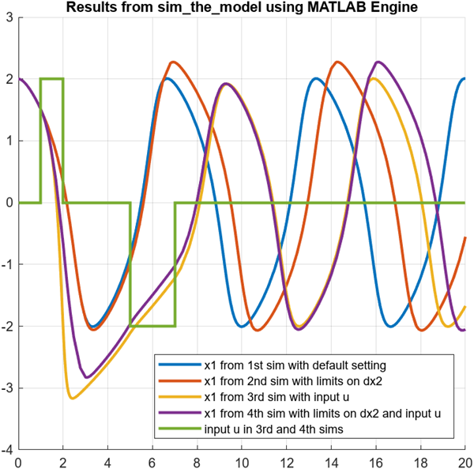
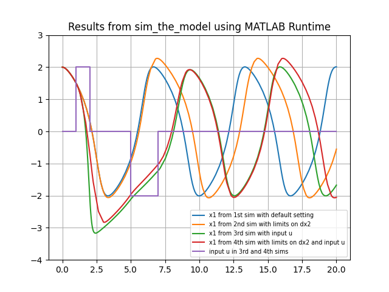

# Simulate a Simulink&reg; model from Python&reg; 

This example illustrates two ways to simulate a Simulink model (named <code>the_model</code>) via a wrapper MATLAB&reg; function (named <code>sim_the_model</code>) from Python. 

 
The first approach, shown in <code>call_sim_the_model_using_matlab_engine.py</code>, uses the [MATLAB Engine API for
Python](https://www.mathworks.com/help/matlab/matlab_external/install-the-matlab-engine-for-python.html) to call the wrapper function <code>sim_the_model.m</code> multiple times passing in different parameters and external input signals. 

 
The second approach uses [MATLAB Compiler
SDK](https://www.mathworks.com/help/compiler_sdk/gs/create-a-python-application-with-matlab-code.html)&trade; and [Simulink Compiler](https://www.mathworks.com/help/slcompiler/ug/deploy-from-matlab-command-line.html)&trade; to first build a Python package around the wrapper function <code>sim_the_model.m</code> as shown in
<code>build_python_package_around_sim_the_model.m</code>. We can then call this package to run the warpper function <code>sim_the_model.m</code> multiple times passing in different parameters and external input signals as show in <code>call_sim_the_model_using_matlab_runtime.py</code>.  

This example includes the following files:

* <code>the_model.slx</code>: the Simulink model we will simulate in the example;
* <code>sim_the_model.m</code>: the wrapper MATLAB function to simulate a Simulink model with the specified parameter and input signal values;
* <code>call_sim_the_model.m</code>: MATLAB script used to call the sim_them_model multiple times in MATLAB with different inputs and parameters; 
* <code>plot_results.m</code>: MATLAB script used by call_sim_the_model to plot the results;
* <code>call_sim_the_model_using_matlab_runtime.py</code>: Python script to call sim_the_model packaged function multiple times and plot the results;
* <code>call_sim_the_model_using_matlab_engine.py</code>: Python script that uses MATLAB Engine API to call sim_the_model.m multiple time and plot the results;
* <code>CallingSimFromPython.pptx</code>: complementary presentation slides describing the demo structure and setup

The model <code>the_model.slx</code> and the wrapper MATLAB function <code>sim_the_model.m</code> illustrate implementation choices that make data marshaling between Python and <code>sim</code> command in MATLAB relatively straight forward and can be used with any Simulink model. These are:

* Parameterizing the Simulink model using workspace variables makes it easy run sim with new parameter values passed in from Python.
* Labeling the logged signals in the model with valid identifiers, makes it easy to pack the results into a MATLAB struct and return to Python.
* Extracting the time and data values as numeric vectors from sim command output and returning these to Python makes data marshaling relatively easy. 

This example has been tested with MATLAB R2022b and Python 3.8. The following MathWorks products are needed for using this example:

* [MATLAB](https://www.mathworks.com/products/matlab.html); 
* [Simulink](https://www.mathworks.com/products/simulink.html); 
* [MATLAB Compiler&trade;](https://www.mathworks.com/products/compiler.html); 
* [MATLAB Compiler SDK](https://www.mathworks.com/products/matlab-compiler-sdk.html); 
* [Simulink Compiler](https://www.mathworks.com/products/simulink-compiler.html); 
 

